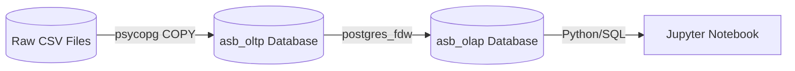
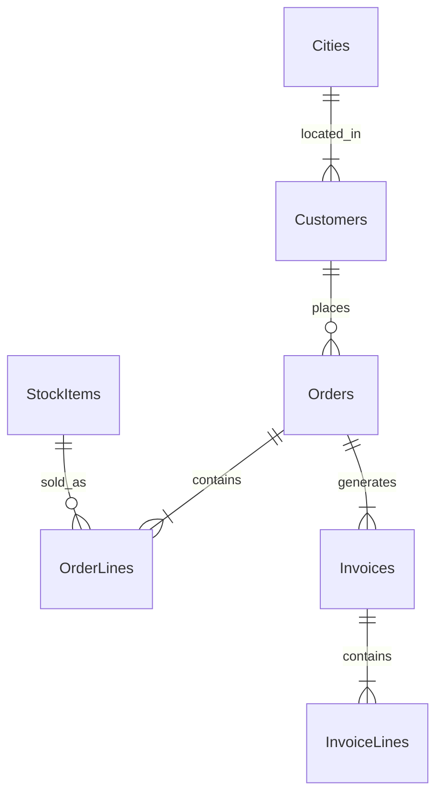
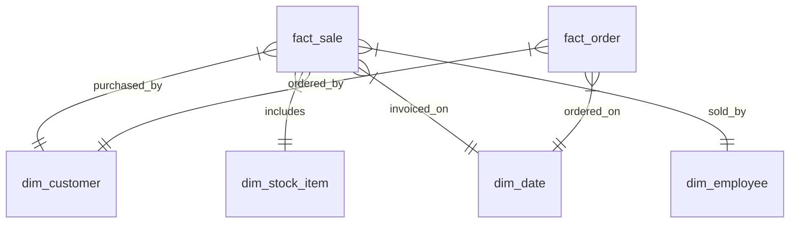

# Wide World Importers - Data Engineering Case Study

This repository contains an end-to-end data pipeline built for the fictitious **Wide World Importers (WWI)** company. It extracts raw CSV operational data, loads it into a normalized **OLTP** PostgreSQL database, and transforms it into an analytical **OLAP** Star Schema using advanced SQL techniques like Foreign Data Wrappers and CTEs for Slowly Changing Dimensions.

---

## 1. Solution Overview & Architecture

**Architecture Flow:**
`Raw CSVs -> Python Ingest -> PostgreSQL (asb_oltp) -> postgres_fdw -> PostgreSQL (asb_olap)`



---

## 2. Technology Stack & Prerequisites

- **Python 3**: Used for orchestration, ingestion parsing, and data quality testing.
- **PostgreSQL 15 (Docker)**: Used as the database engine for both OLTP and OLAP databases.
- **postgres_fdw**: Native PostgreSQL extension used to cleanly query and transform data across databases without Python memory overhead.
- **Docker Compose**: Used to spin up the database container easily.

**Prerequisites:**
- Docker & Docker Compose
- Python 3.10+

---

## 3. Setup Instructions

1. **Clone the repository:**
   ```bash
   git clone <repo-url>
   cd data-engineering-case-study
   ```
2. **Download Raw Data:**
   Download the [Kaggle Wide World Importers dataset](https://www.kaggle.com/datasets/pauloviniciusornelas/wwimporters). Extract the `archive` folder into `data/raw_data/archive/` so that the path looks like `data/raw_data/archive/Sales/Sales.Orders.csv`.
3. **Set up Environment:**
   ```bash
   cp .env.example .env
   python -m venv venv
   source venv/bin/activate
   pip install -r requirements.txt
   ```
4. **Start the Database:**
   ```bash
   docker compose up -d
   ```

---

## 4. Execution (One Command)

To run the entire pipeline end-to-end (CSV -> OLTP -> OLAP + Data Quality):
```bash
source venv/bin/activate && python src/pipeline.py
```

To demonstrate the Slowly Changing Dimension (SCD Type 2) historical tracking:
```bash
source venv/bin/activate && python src/demonstrate_scd.py
```

To explore the business queries in a notebook:
```bash
source venv/bin/activate && jupyter notebook business_queries.ipynb
```

---

## 5. Data Modeling & Diagrams

### 5.1. OLTP Entity-Relationship Diagram (Simplified)


### 5.2. OLAP Star Schema Diagram


### 5.3. Source-to-Target Table Mapping
| Target Table (OLAP) | Source Tables (OLTP) |
|---|---|
| `dim_date` | *Generated dynamically via generate_series* |
| `dim_city` | `cities`, `state_provinces`, `countries` |
| `dim_customer` | `customers`, `customer_categories`, `buying_groups` |
| `dim_employee` | `people` |
| `dim_stock_item` | `stock_items`, `colors`, `package_types` |
| `fact_order` | `orders`, `order_lines` |
| `fact_sale` | `invoices`, `invoice_lines` |

### 5.4. Fact-Table Grain Definitions
- **`fact_order`**: One row per customer **order line**. (Captures early-stage metrics like ordered quantity vs picked quantity, and backorders).
- **`fact_sale`**: One row per customer **invoice line**. (Captures finalized financial metrics like extended price, tax amount, and profit).

---

## 6. Slowly Changing Dimensions (SCD Type 2)
The `dim_customer` table is implemented as an SCD Type 2 dimension. 
- **Mechanism**: Implemented purely in SQL (via `transform.sql`) using Common Table Expressions (CTEs). 
- **Process**: The CTE compares the incoming source data against the current active record (`is_current = TRUE`). If monitored attributes (like Customer Category or Discount) differ, it `UPDATE`s the old record to set `valid_to = CURRENT_TIMESTAMP` and `is_current = FALSE`, and `INSERT`s the new record with `valid_from = CURRENT_TIMESTAMP`.

---

## 7. Assumptions & Limitations
- **Data Types/Formats:** We assumed European decimal formats (`,` instead of `.`) for the `Latitude` and `Longitude` source columns and bypassed this by ingesting as `VARCHAR` before casting. Dates were provided as `DD/MM/YYYY`, requiring `DateStyle = 'DMY'` modifications on ingestion.
- **Initial Load:** Because the CSVs represent a single snapshot, the first pipeline run creates exactly 1 active record per customer. Subsequent updates require manual changes to the OLTP data (simulated in `demonstrate_scd.py`).

---

## 8. Solution Questions

**1. Why did you choose your database, ingestion, transformation, and orchestration tools?**
PostgreSQL was chosen for its robust relational engine and advanced features like FDW. Python was selected for orchestration because of its flexibility and native bindings (`psycopg` `COPY`) which are orders of magnitude faster than pandas for raw data loading. Transformations are done entirely in SQL via Foreign Data Wrappers (`postgres_fdw`) because keeping data in the database engine avoids moving gigabytes of data through Python memory, drastically improving performance.

**2. How did you translate the normalized OLTP structure into your dimensional model, and what is the grain of each fact table?**
The highly-normalized structure (e.g., Countries -> States -> Cities) was aggressively flattened using `LEFT JOIN`s into single, wide dimension tables like `dim_city`. The grain of `fact_order` is one order line, and the grain of `fact_sale` is one invoice line.

**3. Which dimension and attributes use SCD Type 2, which use SCD Type 1, and why?**
`dim_customer` uses SCD Type 2 for categorical attributes (Customer Category, Buying Group). This is critical for reporting because if a customer upgrades from "Retail" to "Wholesale", we don't want to retrospectively re-categorize their past purchases. `dim_stock_item` could also use Type 2, but for simplicity we treat most others as Type 1 (overwrite), which is fine for spelling corrections or minor attribute tweaks where historical tracking adds unnecessary complexity.

**4. How does your pipeline prevent duplicates and produce consistent results when the same input is processed more than once?**
The ingestion step drops and recreates the OLTP schemas. The OLAP transformation step uses `TRUNCATE TABLE` for non-SCD tables to ensure idempotency. The SCD2 logic strictly uses `MERGE`/CTE rules so that re-running the exact same data results in zero updates, preventing duplicate historical rows.

**5. What would you change if the source produced millions of records per day and the business required hourly warehouse updates?**
- **Ingestion**: Replace static CSV dumps with a Change Data Capture (CDC) tool like Debezium reading from the operational database's replication logs, or stream events via Kafka.
- **Transformation**: Move from `TRUNCATE / INSERT` batch jobs to incremental loads using a tool like dbt (data build tool), leveraging incremental models. FDW might struggle with millions of rows across connections, so moving to a true cloud data warehouse (Snowflake/BigQuery) would be necessary.
- **Orchestration**: Upgrade from a simple Python script to Apache Airflow or Dagster to manage task retries, dependencies, and complex scheduling.
